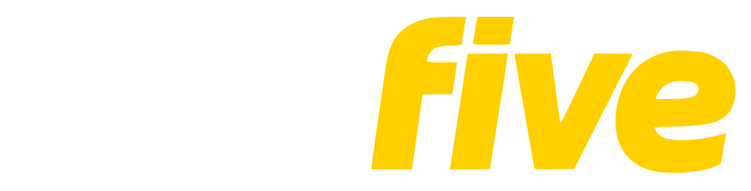
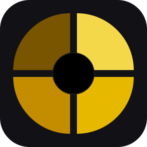

### The FiveM tooling you wish existed.

---

## Enough.

The closed source panels that break on every FiveM update. The tools that phone home without asking. The "premium" solutions gating basic features behind a subscription. The polished screenshots that fall apart in production.

We got tired of it. So we stopped complaining and started shipping.

**runfive** is what the FiveM ecosystem looks like when someone actually cares. Open source from the first commit. No telemetry. No premium tiers. No lock-in. One binary, everything included — because that's how it should have been from day one.

## What we're building

<table>
<tr>
<td width="72" align="center" valign="middle">

</td>
<td valign="middle">

**[runfive](https://github.com/runfivedev/runfive)** &nbsp;·&nbsp; the FiveM server management panel we wished existed 
Go + Svelte. Single binary. SQLite. Self-hosted. Everything included.

&nbsp;&nbsp;

</td>
</tr>
</table>

More is on the bench. You'll know when it ships.

## What we stand for

- **Open source, not open-washed.** Every line. From the first commit. Forever.
- **Self-hosted or nothing.** Your server. Your data. Your rules. No black boxes.
- **No telemetry. Ever.** We don't need to know what you're doing.
- **Polish over features.** We'd rather hold something back than push it half-done.
- **Plainspoken docs.** If it's complex, the docs say so. If it's dangerous, the docs warn you.

## The two of us

<table>
<tr>
<td align="center" width="180">
<a href="https://github.com/Kr3mu">

 
<strong>Kr3mu</strong>
</a>
</td>
<td align="center" width="180">
<a href="https://github.com/simpleC0de">

 
<strong>lananal</strong>
</a>
</td>
</tr>
</table>

Two people. No company. No investors. Just the tools we actually want to use.

## Hang out

The work happens in the open. The conversation happens on Discord.

---

runfive &nbsp;·&nbsp; open source &nbsp;·&nbsp; done right

